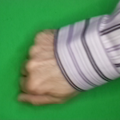

# Rock-Paper-Scissors using Computer Vision

Rock-Paper-Scissors (RPS) is hand game that has existed since (at least) early 20th century. It consists of 3 different hand gestures: rock (the closed hand), paper (the fully opened hand), and scissors (2 fingers, like the peace symbol).

As human, of course we can perceive this gestures easily, but when it comes to machine, we need to use advanced ML algorithms (like CNN) to classify and predict these different hand gestures correctly. The downside of CNN (and all other machine learning techniques), is that we need to train the model before (using sample images) to achieve good prediction accuracy.

While the training process seems simple, there are actually many factors that can affect the CV model, causing bad model prediction, such as:
1. Not enough sample images
2. Different skin and background color
3. Different contrast and brightness
4. Different angle and rotation

Now let's see the (standard) sample images:
|Rock|Paper|Scissors|
|-|-|-|
||||
||||

Seems easy to differentiate, right? Now let's compare it with other image variations:

|Rock|Paper|Scissors|
|-|-|-|
||||
||||

As you can see:
1. While rock can be associated as closed hand (no fingers), different photo angle may cause the fingers to still appear, which can be incorrectly classified as paper.
2. Scissors can also be associated with 2 fingers (the index and the middle one), but what if I don't want to close my thumb? Then there will be 3 fingers in the photo.
3. Although paper is usually associated as a fully opened hand, there is no clear rule whether to keep all the fingers tightly or let them loose. The loose fingers can be incorrectly detected as scissors, while the tight fingers can be detected as rock if the image is stretched (resizing and stretching input image is a common operation in CNN).
4. What if the player is wearing a ring, a band, or a long sleeve? Can the model still predict it correctly?
5. Lastly, what if the image is rotated, greyscaled, or changed to other colors?

None of the model I tried from [Kaggle](https://www.kaggle.com/datasets/drgfreeman/rockpaperscissors/code) can solve this problem (yes, even the most upvoted one). Those models can predict similar images (using train, test, split), but when provided with more ambiguous images like I shared above, they all fail to predict the category/class correctly, even if it's just a change on the background color.

After multiple trial and errors (at least 10x revisions, each revision can take up to 60 minutes model training time), I can conclude that using batch normalization and preprocessing the image using [Canny](https://docs.opencv.org/4.x/da/d22/tutorial_py_canny.html) filter (edge detection) can actually improve the prediction result (even though in theory, the CNN kernel should automatically find these edges).

|Original|Canny|
|-|-|
|||

However, using Canny filter alone is not enough, it's only good to detect edges from different angles (caused by image flipping and rotation). When provided with images with different background colors, it may still fail especially if the color is close to skin color (e.g. red). To fix this problem, I created other preprocessing function that changes the hue (and brightness) of an image.

|Original|Random Hue|Random Brightness|
|-|-|-|
||||

By combining Canny filter and hue changer (each with 50% chance, exclusively) to preprocess the image, the model can now predict all the test images correctly (100% prediction accuracy). Here are a few examples of what the model see for each class:

|Feature Maps of Max Pooling Layer 3|
|-|
||
||
||

## Conclusion
See changelog inside the notebook file.
1. Batch normalization is a great alternative for dropout. The model can learn better important features compared to without using it. However, unlike dropout, batch normalization will increase computation time and process, especially if added on every single layer.
2. Combining Canny filter with hue and brightness changer (each has 50% chance exclusively) for preprocessing images can produce better model, especially if the dataset is pretty small (< 5000 images) and lack variations.
3. The number of dense layer neurons will also affect prediction accuracy. 512 or 1024 neurons are quite acceptable for 5 layered CNN (3 conv, 2 dense). Bigger neurons (e.g. 4096) will start to fail, probably because there are too many features that are taken into consideration.

## Dataset Source
- [Laurence Moroney](https://laurencemoroney.com/datasets.html#rock-paper-scissors-dataset) (link may be dead, use archive.org)
- [Julien de la Bruère-Terreault](https://www.kaggle.com/datasets/drgfreeman/rockpaperscissors/data) ([GitHub](https://github.com/DrGFreeman/rps-cv))
- [Rock paper scissors - Wikipedia](https://wikipedia.org/wiki/Rock_paper_scissors) (images by Fluff and Sertion)